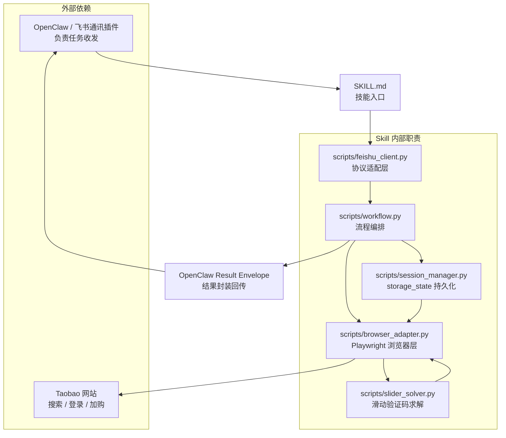

# UI自动化测试 Skill 技术设计文档

## 1. 目标

设计一个可在 OpenClaw 框架中运行的 UI 自动化测试 Skill，完成从飞书接收任务、登录淘宝、搜索指定商品、按条件筛选、加入购物车并回传结果的完整闭环。

该 Skill 的定位是“任务编排 + 浏览器自动化 + 结果回传”，不依赖人工逐步干预，但在登录、验证码、风控、页面结构变化等场景下允许降级为人工确认。

## 2. 业务流程

### 2.1 标准流程

1. 任务下发：通过飞书接受测试任务指令。
2. 浏览器自动化：启动 Chromium（集成 playwright-stealth 反检测），打开 `www.taobao.com`。
3. 会话恢复：优先加载已持久化的 `storage_state` 会话文件；已登录则跳过手动登录。
4. 用户登录：会话失效或不存在时，等待用户在浏览器窗口中手动完成登录，随后自动持久化会话。
5. 商品搜索：在搜索框输入关键词（拟人化打字 + 贝塞尔鼠标轨迹），提交搜索，附带滑动验证码自动求解。
6. 智能筛选：进入商品详情页提取好评率、商品ID、价格，仅保留好评率严格大于阈值的商品。
7. 购物车操作：将符合条件的商品加入购物车，并导航到购物车页面核验加购结果。
8. 结果反馈：将执行结果回传飞书。

### 2.2 关键约束

- 需要兼容 OpenClaw 的 Skill 组织方式。
- 必须将飞书、浏览器、淘宝页面操作拆分为可替换适配层。
- 必须支持中断恢复、失败重试、结构化结果输出。
- 涉及登录、验证码、风控时，不应尝试绕过安全机制，只允许请求用户接管。
- 浏览器操作采用拟人化策略（贝塞尔鼠标轨迹、随机延迟、分段滚动）以降低风控触发概率。
- 滑动验证码退化为人工接管。

## 3. 设计原则

- 单职责：任务解析、浏览器控制、页面理解、结果回传分离。
- 状态化：整个流程以显式状态机驱动，避免“链式 prompt”失控。
- 可观测：每一步都产出结构化日志、截图和结果摘要。
- 可恢复：关键步骤失败后可以重试或从最近检查点恢复。
- 可替换：飞书、浏览器、商品解析器都做成适配器，便于未来接入其他平台。

## 4. OpenClaw 兼容的 Skill 结构

将 Skill 拆成以下逻辑块：

### 4.1 Skill 元数据

Skill 的说明字段必须覆盖触发场景，例如：

- 飞书任务下发
- 浏览器自动化
- 淘宝搜索与筛选
- 购物车操作
- 结果回传

这样 OpenClaw 才能在任务匹配时正确加载该 Skill。

### 4.2 输入契约

建议支持以下输入：

- `task_id`：飞书任务编号
- `feishu_message_id`：消息唯一标识
- `search_keyword`：默认值为“索尼耳机”
- `rating_threshold`：默认值为 `0.99`
- `max_candidates`：最大处理商品数
- `need_screenshot`：是否回传截图证据
- `manual_approval_required`：登录/验证码时是否等待人工接管

### 4.3 输出契约

输出应为结构化 JSON，至少包含：

- `task_id`
- `status`：`success` / `partial_success` / `failed`
- `login_status`
- `search_status`
- `filter_status`
- `cart_status`
- `matched_items`
- `evidence`：截图、页面 URL、时间戳
- `error`：错误码、错误信息、失败步骤

## 5. 总体架构

建议采用四层架构：

### 5.1 任务接入层

负责监听飞书消息、解析任务 payload、生成执行上下文。

职责：

- 拉取飞书消息（责任划分：skill不提供飞书SDK，需openclaw接入）
- 校验任务格式
- 生成 `RunContext`
- 记录任务状态

### 5.2 流程编排层

采用状态机或步骤队列驱动执行。

推荐状态：

- `RECEIVED`
- `BROWSER_READY`
- `LOGIN_PENDING`
- `LOGGED_IN`
- `SEARCHED`
- `FILTERED`
- `ADDED_TO_CART`
- `REPORTED`
- `FAILED`

### 5.3 浏览器执行层

负责真实页面交互：打开网页、输入搜索词、点击筛选、判断列表状态、加入购物车。

能力要求：

- 页面导航
- DOM 定位与文本识别
- 截图
- 异常弹窗处理
- 登录态检测

### 5.4 结果回传层

负责把执行结果写回飞书，包括简版摘要和证据链接。

### 5.5 OpenClaw 通讯边界

如果 OpenClaw 已经接入飞书通讯插件，则通讯层由 OpenClaw 统一负责，Skill 只需要处理进入工作流的任务载荷以及返回给 OpenClaw 的结果封装。

该设计下：

- 飞书消息收发不在 Skill 内部实现。
- `scripts/feishu_client.py` 仅作为协议适配层，负责任务载荷归一化和结果封装。
- Skill 只依赖结构化输入输出，不直接耦合飞书 SDK、Webhook 或轮询逻辑。



## 6. 核心流程设计

### 6.1 飞书任务接收

1. 监听飞书机器人消息或飞书开放平台回调。
2. 提取任务参数，至少包括任务 ID、商品关键词、筛选阈值、结果回传目标。
3. 校验字段完整性。
4. 生成执行上下文并启动工作流。

任务进入 Skill 时应由 OpenClaw 注入标准化 payload，Skill 只依赖字段契约，不依赖具体示例。

### 6.2 浏览器初始化

1. 打开受控浏览器环境。
2. 进入 `https://www.taobao.com`。
3. 检查是否已登录。
4. 若未登录，进入登录分支。

建议将浏览器上下文与任务上下文绑定，确保每个任务独立执行，避免串号。

### 6.3 登录处理

登录是最容易受风控影响的环节，建议采用“自动检测 + 人工接管”的双模式。

策略：

- 如果页面存在扫码登录，等待用户扫码。
- 如果需要短信或验证码，不尝试破解，提示人工完成。
- 登录成功后写入会话状态。

建议判断登录成功的信号：

- 页面出现用户昵称
- 页面进入个人中心或首页已登录态
- Cookie 中出现登录态标志

### 6.4 搜索商品

1. 在淘宝首页输入关键词“索尼耳机”。
2. 提交搜索。
3. 等待结果页加载完成。
4. 记录搜索结果页 URL 和首屏截图。

### 6.5 智能筛选

需要在商品列表中识别好评率严格大于阈值的商品（默认 95%）。

推荐实现方式：

- 优先解析卡片中的显式文本，如“好评率 99%+”。
- 如果页面只显示部分信息，则进入商品详情页补采关键指标。
- 统一将百分比标准化为数值，再做阈值判断。

筛选逻辑：

```text
if praise_rate > threshold then keep
else skip
```

注：代码中使用 `<=` 比较，恰好等于阈值的商品被排除（严格大于语义）。

如果列表页无法直接获取好评率，则需要：

1. 打开候选商品详情页。
2. 检索评价相关指标。
3. 仅对满足阈值的商品保留。

### 6.6 加入购物车

对筛选后的候选商品，按顺序执行加入购物车操作。

建议策略：

- 最多处理 `max_candidates` 个商品。
- 对每个商品记录 `item_id`、标题、价格、好评率。
- 添加成功后校验购物车状态。
- 如出现规格选择弹窗，选择默认可购买规格。

### 6.7 回传飞书

结果回传建议包含：

- 任务执行状态
- 登录是否成功
- 搜索结果数量
- 满足条件的商品数量
- 成功加入购物车数量
- 失败步骤和原因
- 关键截图或证据链接

如果由 OpenClaw 承担飞书通讯，则 Skill 应返回结构化 report envelope，由 OpenClaw 完成实际消息投递。

回传结果应由 OpenClaw 按统一 report envelope 投递，不需要在 Skill 文档中固定某个示例 JSON。

## 7. 状态机设计

建议使用显式状态机，避免隐式流程失控。

### 7.1 状态迁移

- `RECEIVED` -> `BROWSER_READY`
- `BROWSER_READY` -> `LOGIN_PENDING`
- `LOGIN_PENDING` -> `LOGGED_IN`
- `LOGGED_IN` -> `SEARCHED`
- `SEARCHED` -> `FILTERED`
- `FILTERED` -> `ADDED_TO_CART`
- `ADDED_TO_CART` -> `REPORTED`
- 任意状态 -> `FAILED`

### 7.2 失败恢复

- 浏览器初始化失败：重建上下文并重试。
- 登录超时：挂起等待人工接管。
- 搜索结果为空：回传空结果并终止。
- 筛选解析失败：截图留证并终止。
- 加购失败：记录失败商品并继续下一个候选项。

## 8. 数据模型

### 8.1 RunContext

```json
{
  "task_id": "string",
  "feishu_message_id": "string",
  "search_keyword": "string",
  "rating_threshold": 0.99,
  "max_candidates": 5,
  "need_screenshot": true,
  "manual_approval_required": true,
  "session_state_path": ".cache/ui-automation-test/taobao-session.json",
  "session_strategy": "storage_state",
  "session_auto_save": true
}
```

### 8.2 MatchedItem

```json
{
  "title": "string",
  "item_id": "string|null",
  "price": "string|null",
  "rating": 0.96,
  "url": "string|null",
  "cart_added": false
}
```

### 8.3 ExecutionResult

```json
{
  "task_id": "string",
  "status": "success|partial_success|failed",
  "session_status": "restored|captured|missing|unknown",
  "login_status": "success|waiting_manual|failed",
  "search_status": "success|failed",
  "filter_status": "success|failed",
  "cart_status": "success|empty|error|failed",
  "matched_items": [],
  "evidence": [],
  "error": null
}
```

## 9. 风险与对策

### 9.1 登录风控

风险：淘宝可能触发验证码、短信验证或异常登录检测。

对策：

- 允许人工接管登录。
- 不做任何绕过行为。
- 提前超时并回传状态。

### 9.2 页面结构变化

风险：商品卡片和评价信息 DOM 结构可能变化。

对策：

- 优先使用多策略定位。
- 使用文本、ARIA、DOM 结构联合识别。
- 关键页面保留截图和 DOM 快照。

### 9.3 商品评价信息不可见

风险：列表页可能无法直接拿到 99% 好评率。

对策：

- 支持详情页补采。
- 允许标记为 `partial_success`。

### 9.4 多商品处理时效

风险：逐个详情页补采会耗时较长。

对策：

- 限制候选商品数量。
- 并发仅用于读操作，写操作保持串行。

### 9.5 风控滑动验证码

风险：频繁页面切换可能触发淘宝风控系统的 GeeTest 滑动验证码。

对策：

- 所有浏览器操作增加拟人化行为：贝塞尔鼠标轨迹、随机延迟 (2-5s)、分段滚动模拟浏览、随机鼠标移动。
- 若遇滑动验证码，回退为人工接管。

## 10. 测试方案

### 10.1 单元测试

- 任务消息解析
- 好评率阈值判断
- 状态机迁移
- 结果结构化输出

### 10.2 集成测试

- 飞书回调到任务启动
- 浏览器打开与登录状态识别
- 搜索页解析与候选筛选
- 加购物车结果校验
- 飞书结果回传

### 10.3 端到端测试

- 使用受控测试账号和测试商品环境完成整链路。
- 每次执行保存截图、日志和最终 JSON 结果。

## 11. 可观测性

建议至少记录以下信息：

- 每一步开始/结束时间
- 页面 URL
- 关键截图路径
- 当前状态码
- 失败原因和堆栈摘要

## 12. 验收标准

该 Skill 可视为完成，需满足：

- 能接收飞书任务并成功启动。
- 能进入淘宝并完成登录或人工接管提示。
- 能搜索“索尼耳机”。
- 能识别并筛选好评率大于等于 99% 的商品。
- 能将符合条件的商品加入购物车。
- 能把结果回传飞书。
- 能输出结构化执行结果和证据。

## 13. 建议的 Skill 目录结构

```text
Agent_Demo/
  SKILL.md
  requirements.txt
  UI自动化测试Skill-技术设计文档.md
  scripts/
    __init__.py
    browser_adapter.py       # Playwright + Stealth 浏览器适配层
    config.py                 # OpenClaw Skill 配置
    feishu_client.py          # 飞书协议适配层
    models.py                 # 数据模型 (TaskContext, MatchedItem, WorkflowResult)
    run_workflow.py           # CLI 入口
    session_flow.py           # 会话恢复/持久化流程
    session_manager.py        # storage_state 文件读写
    slider_solver.py          # ddddocr + OpenCV 滑动验证码求解
    workflow.py               # 状态机流程编排
    .cache/ui-automation-test/
      taobao-session.json     # 持久化会话
      artifacts/              # 截图证据
```

## 14. 建议的 SKILL.md 说明要点

建议 SKILL.md 的 description 覆盖以下触发词：

- 飞书任务
- 淘宝自动化
- 登录
- 搜索商品
- 购物车
- 结果回传

并在正文中明确：

- 使用 OpenClaw 风格的任务输入输出。
- 浏览器操作由工具适配层完成。
- 登录与验证码场景允许人工接管。
- 不执行任何绕过风控的行为。

## 15. 当前实现状态

### 已完成的功能

| 模块 | 状态 | 说明 |
|------|------|------|
| 飞书协议适配 | ✅ | OpenClaw 协议适配层，payload 归一化 & report envelope 封装 |
| 浏览器启动 | ✅ | Chromium + playwright-stealth 反检测（20 项 evasiion patch） |
| 会话恢复/持久化 | ✅ | storage_state 文件自动读写，路径基于 scripts/ 目录解析 |
| 手动登录 | ✅ | 弹出浏览器窗口，自动检测登录成功（最长等待 300s） |
| 商品搜索 | ✅ | 拟人化打字 + 贝塞尔鼠标轨迹 + 多重提交回退链 |
| 好评率提取 | ✅ | 9 种正则模式 + 多 CSS 选择器 + 详情页懒加载滚动触发 |
| 商品 ID 提取 | ✅ | 从详情页 URL `?id=` 参数提取 |
| 价格提取 | ✅ | 多 CSS 选择器覆盖 Tmall/Taobao（`#J_StrPr498`、`.tm-price` 等） |
| 加购 | ✅ | 拟人化点击 + 结果校验 |
| 购物车核验 | ✅ | 导航到 `cart.taobao.com` 并统计实际商品行数 |
| 滑动验证码求解 | ✅ | ddddocr ML 目标检测 + OpenCV 模板匹配双模，含贝塞尔拖拽轨迹 |
| 拟人化行为 | ✅ | 随机延迟、分段滚动、随机鼠标移动、浏览模拟 |
| 截图证据 | ✅ | 搜索页 + 购物车页全屏截图 |
| 结构化结果输出 | ✅ | JSON 包含所有步骤记录、商品详情、状态码 |

### 活跃测试记录

最近两次端到端测试（搜索"苹果手机"，阈值 0.95，最多 10 个候选）：

| 指标 | 第一次（修复前） | 第二次（修复后） |
|------|----------------|----------------|
| 会话恢复 | ❌ 路径漂移未找到 | ✅ 成功恢复 |
| 登录 | ✅ 手动登录 ~27s | ✅ 跳过（会话有效） |
| 搜索 | ⚠️ 兜底直接 URL | ⚠️ 兜底直接 URL（搜索表单交互不稳定） |
| 好评率提取率 | 4/10 | 7/10 |
| 加入购物车 | 3 件 | 7 件 |
| CAPTCHA 触发 | 未触发 | 未触发 |
| item_id 提取 | ❌ 全部为空 | ✅ 全部填充 |
| price 提取 | ❌ 全部为空 | ✅ 全部填充 |
| 购物车核验 | ❌ 假成功 | ✅ 实际计数 70 件 |

## 16. 结论

这个 Skill 的核心不是“把提示词写长”，而是把 UI 自动化拆成可执行、可恢复、可回传的状态机。只要把飞书接入、浏览器自动化、商品筛选和结果回传四个边界层分开，就可以稳定兼容 OpenClaw，并支持后续扩展到更多站点和更多筛选条件。